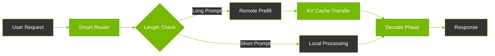
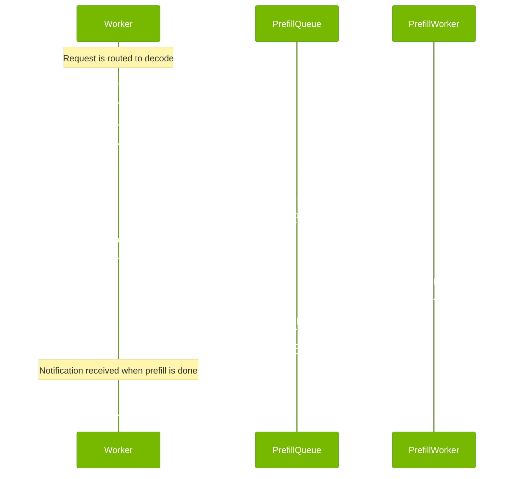
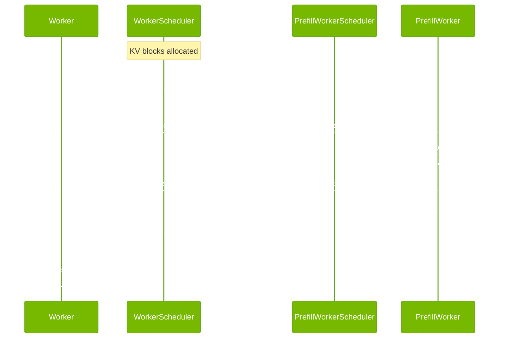

<!--
SPDX-FileCopyrightText: Copyright (c) 2025 NVIDIA CORPORATION & AFFILIATES.
All rights reserved.
SPDX-License-Identifier: Apache-2.0

Licensed under the Apache License, Version 2.0 (the "License");
you may not use this file except in compliance with the License.
You may obtain a copy of the License at

http://www.apache.org/licenses/LICENSE-2.0

Unless required by applicable law or agreed to in writing, software
distributed under the License is distributed on an "AS IS" BASIS,
WITHOUT WARRANTIES OR CONDITIONS OF ANY KIND, either express or implied.
See the License for the specific language governing permissions and
limitations under the License.
-->

# Dynamo Disaggregation: Optimizing LLM Performance Through Smart Task Distribution

## What is Disaggregated Serving?

Disaggregated serving is Dynamo's innovative approach to LLM inference that splits processing into two specialized phases:

1. **Prefill Phase**: Initial processing of your prompt
2. **Decode Phase**: Generating the actual response

By separating these phases, Dynamo can optimize each for maximum performance, leading to:
- Faster response times
- Higher throughput
- Better resource utilization
- Support for longer contexts

## Key Benefits

### 1. Optimized Resource Usage
- **Specialized Hardware Allocation**: Match each phase with the most suitable hardware
- **Efficient Scaling**: Scale prefill and decode resources independently
- **Better GPU Utilization**: Prevent long prompts from blocking other requests

### 2. Performance Improvements
- **Faster Response Times**: Up to 3x improvement in time-to-first-token
- **Higher Throughput**: Process more requests concurrently
- **Long Context Support**: Handle large prompts without impacting other requests

### 3. Smart Adaptation
- **Automatic Mode Selection**: Dynamically chooses between local or remote processing
- **Workload Optimization**: Adapts to varying request patterns
- **Resource Balancing**: Maintains optimal performance under different loads

## How It Works



## Design



## Components

Dynamo's disaggregation system consists of four main components:

### 1. Worker
- Executes both prefill and decode requests
- Makes intelligent routing decisions
- Manages KV block allocation

### 2. Prefill Worker
- Specializes in prefill computations
- Optimized for computation-heavy tasks
- Efficiently handles long context windows

### 3. Smart Router
- Makes intelligent prefill routing decisions
- Considers request characteristics
- Optimizes for system performance

### 4. Prefill Queue
- Manages remote prefill requests
- Provides load balancing
- Ensures efficient request handling

## Conditional Disaggregation

Dynamo intelligently decides whether to process prefill locally or remotely based on:

### Request Characteristics
- Prefill length
- Prefix cache hit rate
- System load conditions

### System State
- Queue length
- Worker availability
- Resource utilization

This dynamic decision-making ensures optimal performance across different workloads and conditions.

## Efficient KV Transfer



### Key Features

1. **Direct Memory Transfer**
   - Uses NIXL for GPU-to-GPU transfer
   - Minimizes data movement overhead
   - Supports non-blocking operations

2. **Memory Optimization**
   - Efficient block allocation
   - Continuous block merging
   - Layout transformation support

3. **Performance Enhancements**
   - Non-blocking operations
   - Parallel request processing
   - Optimized memory descriptors

## Runtime-Reconfigurable Architecture

Dynamo's disaggregation system supports dynamic scaling with zero downtime:

### Worker Management
- **Add Worker**: Automatic NIXL metadata registration
- **Remove Worker**: Graceful flush and cleanup
- **Add Prefill Worker**: Zero-config integration
- **Remove Prefill Worker**: Clean engine shutdown

### Auto-Discovery
- Uses etcd for component registration
- Enables automatic worker discovery
- Supports seamless scaling

### Graceful Shutdown
- Completes in-flight requests
- Proper resource cleanup
- Zero request loss

## Example Usage

```bash
# Start disaggregated serving
dynamo serve graphs.disagg:Frontend -f ./configs/disagg.yaml

# Monitor component registration
watch -cd etcdctl get --prefix <namespace>
```

### Component Registration Example
```json
{
  "component": "PrefillWorker",
  "endpoint": "mock",
  "namespace": "dynamo",
  "lease_id": 7587886413599009310,
  "transport": {
    "nats_tcp": "dynamo_prefillworker_0d6df828.mock-694d967da694ea1e"
  }
}
```