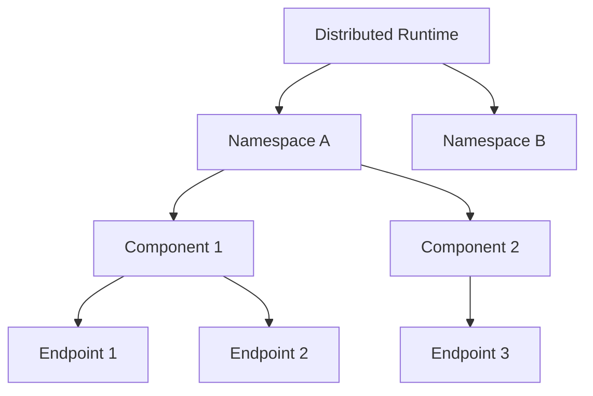
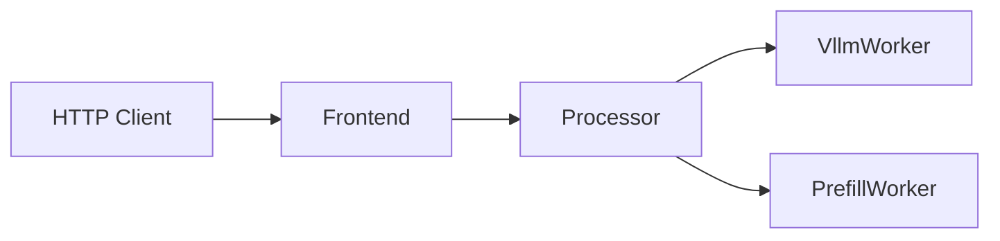
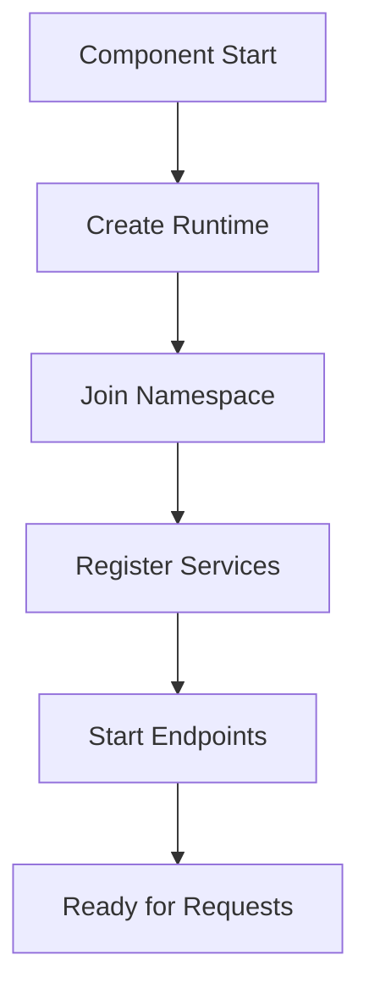
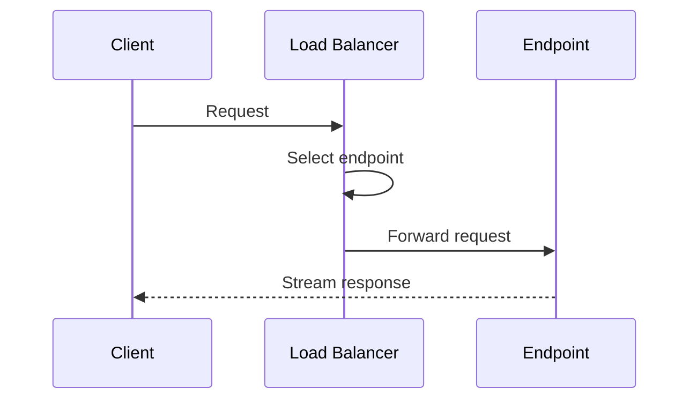

<!--
SPDX-FileCopyrightText: Copyright (c) 2025 NVIDIA CORPORATION & AFFILIATES. All rights reserved.
SPDX-License-Identifier: Apache-2.0

Licensed under the Apache License, Version 2.0 (the "License");
you may not use this file except in compliance with the License.
You may obtain a copy of the License at

http://www.apache.org/licenses/LICENSE-2.0

Unless required by applicable law or agreed to in writing, software
distributed under the License is distributed on an "AS IS" BASIS,
WITHOUT WARRANTIES OR CONDITIONS OF ANY KIND, either express or implied.
See the License for the specific language governing permissions and
limitations under the License.
-->

# Dynamo Distributed Runtime

## What is the Distributed Runtime?

The Distributed Runtime is Dynamo's intelligent communication backbone that enables seamless coordination between components in your LLM deployment. Built for reliability and performance, it ensures your distributed system operates as a cohesive unit, whether running on a single machine or across multiple nodes.

## Key Benefits

- **Seamless Scaling**: Automatically discovers and integrates new components as your deployment grows
- **High Reliability**: Built-in fault tolerance and automatic recovery mechanisms
- **Language Agnostic**: Core functionality in Rust with bindings for Python and other languages
- **Flexible Deployment**: Supports both local and distributed environments
- **Performance Optimized**: Efficient communication with minimal overhead

## Architecture Overview

The Distributed Runtime uses a hierarchical structure to organize and manage components:



### Components

1. **Distributed Runtime**
   - The top-level coordinator
   - Manages connections to service discovery (etcd) and messaging (NATS)
   - Handles component lifecycle and fault tolerance

2. **Namespaces**
   - Logical groupings for different model deployments
   - Provides isolation between different services
   - Enables independent scaling and management

3. **Components**
   - Represents functional units like workers or services
   - Automatically discoverable within their namespace
   - Can be scaled independently

4. **Endpoints**
   - Network-accessible service points
   - Provides specific functionality (e.g., model inference)
   - Automatically load balanced

## Real-World Example: LLM Serving

Let's look at how the Distributed Runtime orchestrates a real LLM serving deployment. Consider a typical setup from `examples/llm/configs/disagg.yaml` that demonstrates the power of Dynamo's distributed architecture:



### Component Roles

1. **Frontend Service**
   - Exposes HTTP endpoints for client requests
   - Provides OpenAI-compatible API (`chat/completions`)
   - Routes requests to the Processor

2. **Request Processor**
   - Handles chat template formatting
   - Performs tokenization
   - Intelligently routes requests to workers

3. **Inference Workers**
   - **VllmWorker**: Handles token generation (decode phase)
   - **PrefillWorker**: Processes initial prompts (prefill phase)

### How It Works

Each component runs in its own process with its own Distributed Runtime instance, but they all:
- Share a common namespace (`dynamo`)
- Auto-discover each other through service registration
- Communicate efficiently using optimized protocols

### Implementation Details

The components are defined using Dynamo's Python decorators:
```python
# Component definition
@service(namespace="dynamo")
class Frontend:
    # Endpoint definition
    @endpoint
    async def chat_completions(self, request):
        # Implementation
        pass
```

## Deployment Modes

Dynamo's Distributed Runtime supports two deployment modes to match your needs:

### Dynamic Mode (Recommended)

- **Automatic Discovery**: Components find each other automatically
- **Flexible Scaling**: Add or remove components without configuration changes
- **High Availability**: Built-in support for component failover
- **Requirements**: Needs etcd for service discovery and NATS for messaging

### Static Mode

- **Simpler Setup**: No service discovery needed
- **Fixed Architecture**: Components use pre-configured addresses
- **Lighter Weight**: Operates without etcd dependency
- **Best For**: Development or simple deployments

## How Component Discovery Works

The Distributed Runtime uses a sophisticated but automated process to manage components:

### 1. Runtime Initialization
- Connects to etcd for service discovery (dynamic mode)
- Establishes NATS messaging channels
- Sets up health monitoring and lease management

### 2. Component Registration


### 3. Health Management
- Automatic lease renewal with etcd
- Background health monitoring
- Graceful shutdown on failures

### 4. Service Discovery
Components are organized in a hierarchical structure:
```
/services
  /namespace
    /component
      /endpoint-{id}
```

## Making Service Calls

Dynamo provides a flexible and efficient way to communicate between components through its client interface.

### Client Features

- **Automatic Discovery**: Finds available endpoints without manual configuration
- **Load Balancing**: Built-in strategies for optimal request distribution
- **Real-time Updates**: Automatically adapts to endpoint changes
- **Streaming Support**: Efficient handling of large responses

### Load Balancing Options

Choose from three strategies to match your needs:

1. **Round Robin** (Default)
   - Evenly distributes requests across endpoints
   - Best for balanced workloads
   - Example:
     ```python
     client = Client(strategy="round_robin")
     ```

2. **Random**
   - Randomly selects endpoints
   - Good for simple load distribution
   - Example:
     ```python
     client = Client(strategy="random")
     ```

3. **Direct**
   - Routes to specific endpoints
   - Useful for sticky sessions or debugging
   - Example:
     ```python
     client = Client(strategy="direct", endpoint_id="worker-1")
     ```

### How It Works



1. Client creates request
2. Load balancer selects endpoint
3. Request sent via NATS
4. Response streamed via direct TCP

## Getting Started

Dynamo provides comprehensive examples to help you start building distributed applications:

### Quick Start Examples

1. **Python Hello World**
   ```python
   # Simple endpoint example
   from dynamo.runtime import service, endpoint

   @service(namespace="demo")
   class HelloService:
       @endpoint
       async def greet(self, name: str) -> str:
           return f"Hello, {name}!"
   ```

2. **Complete LLM Service**
   - Full vLLM-based inference service
   - Includes prompt handling and tokenization
   - Location: `lib/bindings/python/examples/hello_world/server_vllm.py`

### Example Locations

- **Python Examples**: `/lib/bindings/python/examples/`
- **Rust Examples**: `/lib/runtime/examples/`

### Building for ARM

When building vLLM for ARM architectures:

```bash
# For resource-constrained systems
./container/build.sh --framework vllm --platform linux/arm64 \
    --build-arg VLLM_MAX_JOBS=2

# For high-performance systems (e.g., GB200)
./container/build.sh --framework vllm --platform linux/arm64 \
    --build-arg VLLM_MAX_JOBS=64
```

> **Note**: ARM builds currently require building vLLM from source. See [vLLM Issue 8878](https://github.com/vllm-project/vllm/issues/8878) for details.
