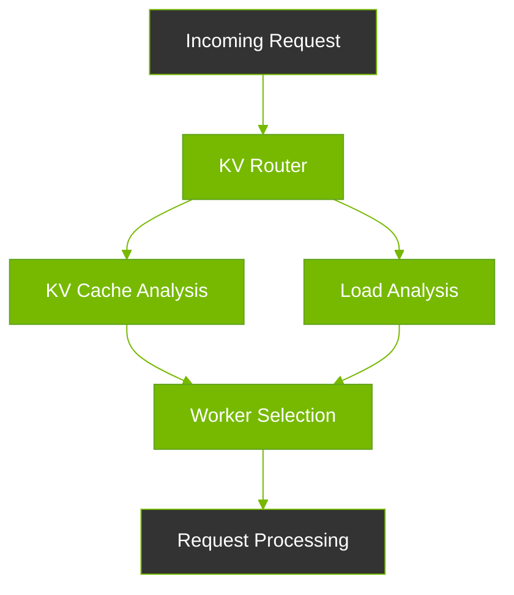

<!--
SPDX-FileCopyrightText: Copyright (c) 2025 NVIDIA CORPORATION & AFFILIATES. All rights reserved.
SPDX-License-Identifier: Apache-2.0

Licensed under the Apache License, Version 2.0 (the "License");
you may not use this file except in compliance with the License.
You may obtain a copy of the License at

http://www.apache.org/licenses/LICENSE-2.0

Unless required by applicable law or agreed to in writing, software
distributed under the License is distributed on an "AS IS" BASIS,
WITHOUT WARRANTIES OR CONDITIONS OF ANY KIND, either express or implied.
See the License for the specific language governing permissions and
limitations under the License.
-->

# Smart KV Cache Routing: Maximizing LLM Performance Through Intelligent Request Distribution

## What is KV Cache Routing?

KV Cache Routing is Dynamo's intelligent system for directing LLM requests to the most efficient workers while maintaining optimal system performance. It considers both cached data availability and worker load to make smart routing decisions.

## Benefits

### 1. Enhanced Performance
- **Faster Response Times**: Up to 3x improvement in time-to-first-token
- **Higher Throughput**: 2x reduction in average request latency
- **Better Resource Utilization**: Maximizes GPU efficiency

### 2. Intelligent Load Balancing
- **Cache-Aware Distribution**: Routes requests to workers with relevant cached data
- **Load-Based Decisions**: Prevents worker overload
- **Dynamic Adaptation**: Adjusts to changing workload patterns

### 3. Cost Efficiency
- **Reduced Computation**: Reuses cached data when possible
- **Optimized Resource Usage**: Balances cache hits with worker load
- **Minimized Redundancy**: Prevents unnecessary recomputation

## How It Works



### Decision Making Process

The router uses a sophisticated scoring system:
```python
score = (cache_hit_rate * weight_cache) - (worker_load * weight_load)
```

Example scenario:
```text
Worker 1: 15% cache hit, 30% load → score = -0.15
Worker 2: 50% cache hit, 50% load → score = 0.00 (Selected)
Worker 3: 75% cache hit, 80% load → score = -0.05
```

## Components

### 1. KV Publisher
- Tracks KV cache events in real-time
- Reports block creation and removal
- Enables global cache visibility

### 2. KV Indexer
- Maintains global cache state
- Uses efficient prefix tree structure
- Provides fast cache lookup

Example usage:
```python
from dynamo.llm import KvIndexer

indexer = KvIndexer(kv_listener, block_size=16)
matches = indexer.find_matches_for_request(token_ids)
# Returns: {worker_id: matched_blocks}
```

### 3. Metrics Publisher
- Monitors worker performance
- Tracks resource utilization
- Reports system health metrics

Key metrics:
- Request queue length
- GPU cache usage
- Cache hit rates
- Active request slots

### 4. Metrics Aggregator
- Collects system-wide metrics
- Provides real-time insights
- Enables informed routing decisions

Example metrics view:
```python
metrics = metrics_aggregator.get_metrics()
for endpoint in metrics.endpoints:
    print(f"Worker {endpoint.worker_id}:")
    print(f"  - Load: {endpoint.gpu_cache_usage_perc}%")
    print(f"  - Queue: {endpoint.num_requests_waiting}")
```

## Implementation Guide

### 1. Basic Setup
```python
from dynamo.runtime import service, endpoint

@service(namespace="demo")
class Router:
    @endpoint
    async def route_request(self, request):
        matches = self.kv_indexer.find_matches(request.tokens)
        metrics = self.metrics_aggregator.get_metrics()
        return self.select_best_worker(matches, metrics)
```

### 2. Routing Strategies

Choose from multiple routing approaches:

1. **Random Routing**
   ```python
   client.generate()  # or client.random()
   ```

2. **Round Robin**
   ```python
   client.round_robin()
   ```

3. **Direct Routing**
   ```python
   client.direct(input, component_id)
   ```

### 3. Custom Routing Logic

Implement your own routing strategy:
```python
def custom_router(matches, metrics):
    scores = {}
    for worker_id, cache_hits in matches.items():
        load = metrics.get_worker_load(worker_id)
        scores[worker_id] = calculate_score(cache_hits, load)
    return max(scores, key=scores.get)
```

## Best Practices

1. **Cache Management**
   - Monitor cache utilization
   - Set appropriate eviction policies
   - Balance cache size with memory usage

2. **Load Balancing**
   - Consider multiple metrics
   - Adjust weights based on workload
   - Monitor system performance

3. **Performance Tuning**
   - Optimize block sizes
   - Adjust routing parameters
   - Monitor and adjust thresholds

## Monitoring and Debugging

### 1. Metrics Visualization
```python
from dynamo.llm import KvMetricsAggregator

metrics_aggregator = KvMetricsAggregator(listener)
for endpoint in metrics_aggregator.get_metrics().endpoints:
    print(f"Worker {endpoint.worker_id} Status:")
    print(f"Cache Usage: {endpoint.gpu_cache_usage_perc}%")
    print(f"Queue Length: {endpoint.num_requests_waiting}")
```

### 2. Cache Analysis
```python
indexer = KvIndexer(listener)
matches = indexer.find_matches_for_request(tokens)
print("Cache Distribution:", matches)
```

### 3. Performance Monitoring
Monitor key metrics through your preferred observability platform:
- Request latency
- Cache hit rates
- Worker utilization
- Queue lengths